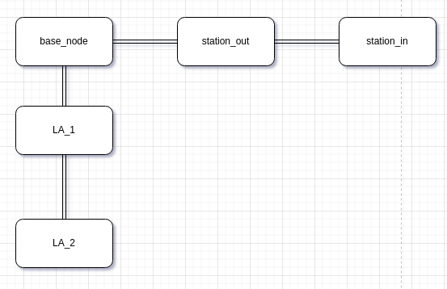

# 1. 拓扑地图


```
struct road_node {
    std::string node_name;
    std::pair<double, double> position;
    std::vector<std::string> connect_list;
    std::vector<double> lenght_list;
};

std::vector<std::pair<std::string, std::string>> segline_names;
```
